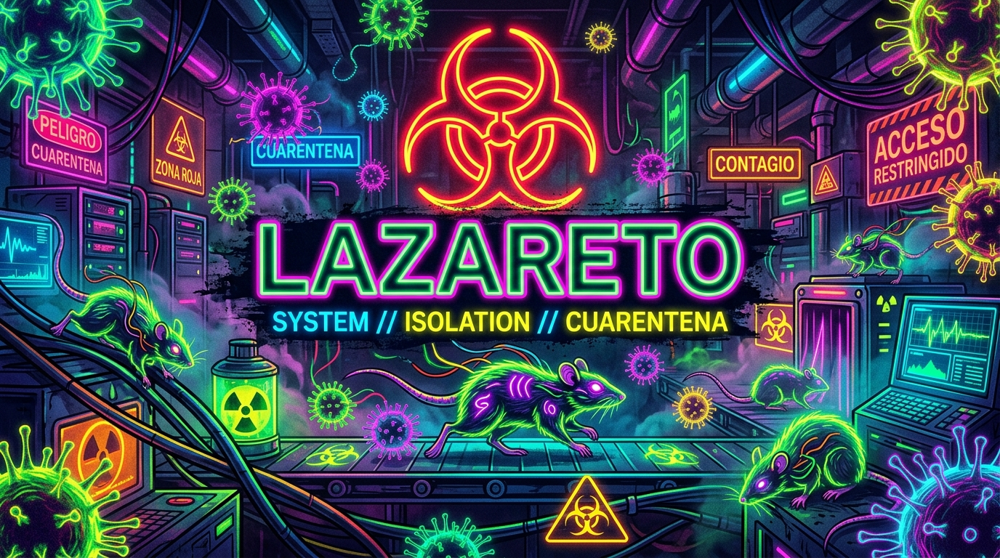

# lazareto



Repositorio **privado** de muestras de malware real, recuperadas de forma pasiva por [Oráculo SOC](https://github.com/drplagash) — una plataforma de honeypots controlada y aislada, operada y de propiedad del autor, sin intervención sobre sistemas de terceros. Cada muestra queda referenciada por SHA256 al payload que la originó en [yersinia](https://github.com/drplagash/yersinia) y, cuando aplica, al indicador de infraestructura correspondiente en [rattus-rattus](https://github.com/drplagash/rattus-rattus).

**Este repositorio no es público, no está indexado, y el acceso está restringido a quien el propietario autorice explícitamente.**

---

## Aviso legal y descargo de responsabilidad

Léase antes de acceder a cualquier archivo de este repositorio. El acceso a este contenido implica la aceptación de los términos aquí descritos.

### 1. Propósito

El contenido de este repositorio existe **exclusivamente con fines de investigación en ciberseguridad, análisis de amenazas (threat intelligence) y educación**. Las muestras aquí alojadas fueron capturadas de forma **pasiva**, como resultado de ataques reales dirigidos de forma no solicitada contra un entorno de honeypot (T-Pot / Cowrie / ADBHoney) desplegado, controlado y aislado por el autor, dentro de infraestructura propia. En ningún caso el autor comprometió, atacó, accedió sin autorización, ni interactuó ofensivamente contra sistema de terceros alguno para obtener estas muestras — son el atacante quien inició el contacto contra el señuelo.

### 2. No se otorga ninguna licencia de uso sobre el malware

A diferencia del resto de los repositorios de este proyecto (que sí publican datos bajo licencia MIT), **el contenido binario/ejecutable de este repositorio NO está licenciado para su uso, redistribución, modificación o ejecución bajo ningún concepto**. Las muestras se comparten (con las personas explícitamente autorizadas por el propietario) únicamente para su inspección, análisis estático/dinámico en entornos aislados, y estudio de técnicas de ataque — nunca para su despliegue, ejecución fuera de un entorno de laboratorio controlado, ni para ningún fin malicioso, ofensivo o ilícito.

### 3. Sin garantía de ningún tipo

Todo el contenido se provee **"tal cual" ("as is")**, sin garantía de ningún tipo, expresa o implícita. El autor no garantiza la integridad, exactitud, inocuidad ni el comportamiento de ninguna muestra. **Ejecutar cualquier archivo de este repositorio fuera de un entorno aislado, desconectado y desechable (sandbox/VM sin red, snapshot revertible) es responsabilidad exclusiva de quien lo haga.** El autor no se responsabiliza por ningún daño, pérdida de datos, infección, o consecuencia derivada del mal manejo de este material por parte de terceros con acceso autorizado.

### 4. Empaquetado de seguridad

Todo binario se distribuye comprimido dentro de un `.zip` protegido con contraseña (convención estándar de la industria — la misma que usan MalwareBazaar, VX-Underground y theZoo) para:
- evitar la ejecución accidental por doble clic,
- evitar el escaneo/cuarentena automática por parte de antivirus y plataformas de mensajería/almacenamiento durante la transferencia,
- dejar explícito, mediante ese único paso extra deliberado, que quien lo abre entiende que está manipulando una muestra real.

Contraseña de archivo: `infected` (convención estándar del sector, no es un mecanismo de seguridad — es una señal de intención, no una barrera técnica).

### 5. Origen y cadena de custodia

Cada muestra documenta en su ficha: SHA256, fecha y sensor de captura (honeypot propio), clasificación, coincidencias YARA (ruleset comunitario [Yara-Rules](https://github.com/Yara-Rules/rules)), y el payload/sesión de origen en `yersinia` cuando se pudo asociar. Ninguna muestra proviene de fuentes de terceros, leaks, ni fue descargada de repositorios ajenos — el 100% del contenido fue capturado directamente por la infraestructura propia del autor.

### 6. Restricción de acceso y no redistribución

El acceso a este repositorio privado está limitado a las personas que el propietario invite explícitamente (analistas SOC, investigadores de seguridad, fines académicos verificables). **Queda prohibida la redistribución del contenido fuera de este repositorio** sin autorización expresa del propietario. Si se te otorgó acceso, sos responsable de mantener la misma restricción hacia terceros.

### 7. Cumplimiento normativo

El autor opera este proyecto de buena fe, en el marco de la investigación defensiva de amenazas, y no tiene conocimiento de que la captura pasiva de malware dirigido contra infraestructura propia (honeypot) constituya delito bajo la legislación de la República Argentina. El uso indebido del contenido por parte de terceros que accedan a este repositorio es responsabilidad exclusiva de esos terceros, no del autor.

---

## Qué hay en este repositorio

```
lazareto/
├── WALLETS.md         (listado consolidado de wallets encontradas, con estado OFAC/denuncia)
└── familias/
    └── <clasificacion>/
        └── <sha256-corto>/
            ├── muestra.zip  (password: infected)
            └── ficha.md     (metadata + YARA + veredicto VirusTotal + wallet + payload de origen)
```

Accesos rápidos por familia:

- [`cryptominer/`](familias/cryptominer/) — mineros de criptomonedas (XMRig, ADBMiner, CoinHive, etc.)
- [`backdoor/`](familias/backdoor/) — troyanos/backdoors (incluye webshells)
- [`downloader/`](familias/downloader/) — droppers/descargadores
- [`c2_client/`](familias/c2_client/) — clientes de botnet/C2
- [`no_clasificado/`](familias/no_clasificado/) — pendiente de revisión manual

**[Ver WALLETS.md](WALLETS.md)** — todas las wallets de criptominería extraídas hasta ahora, con su estado real contra la lista de direcciones sancionadas de OFAC (se actualiza cada 24h) y, cuando esté disponible, Chainabuse.

Actualizado junto con `yersinia` — solo se agregan/actualizan muestras, nada se pierde.

## Referencias cruzadas

- Payload/comando que originó la descarga → [yersinia](https://github.com/drplagash/yersinia) (público), por SHA256 del payload.
- Infraestructura del atacante en el momento de la captura → [rattus-rattus](https://github.com/drplagash/rattus-rattus) (privado), por IP.
- Wallets de criptominería → [WALLETS.md](WALLETS.md), verificadas contra OFAC/Chainabuse.

## Licencia

Este `README.md` y la documentación del repositorio se publican bajo licencia MIT — ver [LICENSE](LICENSE). **Esto NO se extiende al contenido binario/malware**, que se rige exclusivamente por la sección "Aviso legal y descargo de responsabilidad" de más arriba.
